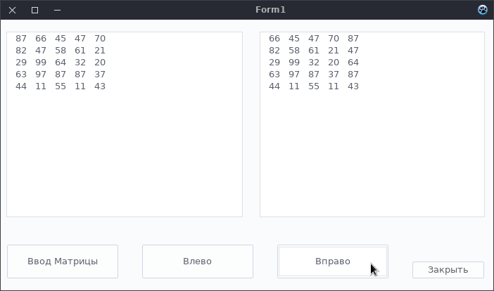
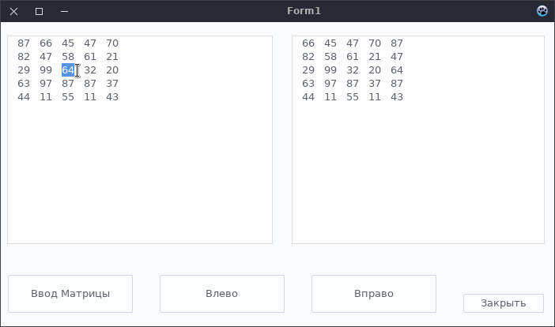
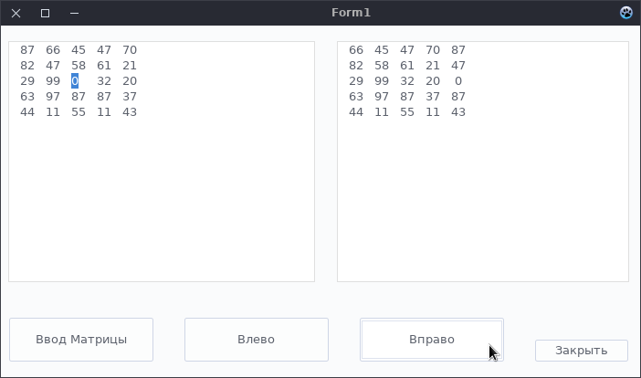
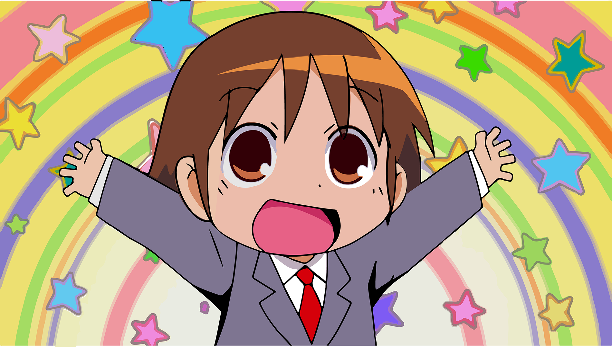

# Реализация с двумя Memo

## Примеры работы программы

#### Перемещение элементов, лежащих на главной диагонали ВЛЕВО

#### Перемещение элементов, лежащих на главной диагонали ВПРАВО

### Задача со звёздочкой с***
    Например, если мы что-то изменим в левом элементе Memo - ИСХОДНАЯ матрица,
    то эти же изменения должны быть отражены и в правом Memo - РЕЗУЛЬТИРУЮЩАЯ матрица
    То есть мы должны считать данные из Memo1 и потом обрабатывать матрицу
    
##### Пример: Заменим какое-нибудь число, лежащие на главной диагонали в левой матрице - исходной

##### И нажмём на 'Вправо'
    Из скрина видно, что всё верно и число 0 переместилось наверх

# Отличненько

