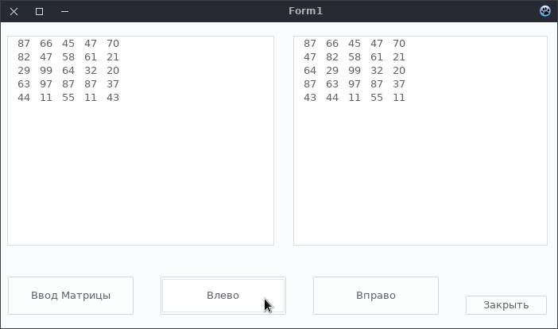

# Реализация с двумя Memo

## Примеры работы программы

#### Перемещение элементов, лежащих на главной диагонали ВЛЕВО

#### Перемещение элементов, лежащих на главной диагонали ВПРАВО

# Ну чё ебаный врот Достаём мармеладных мишек и начинаем тусич

