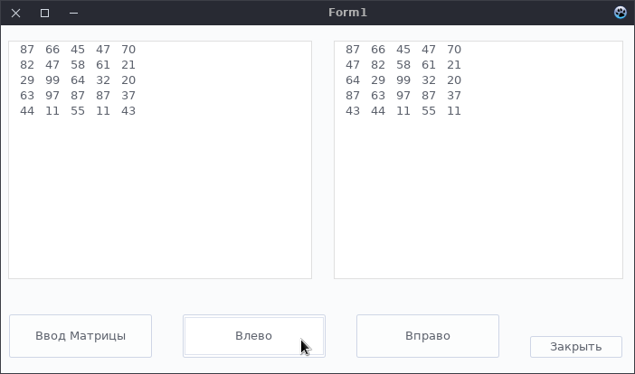
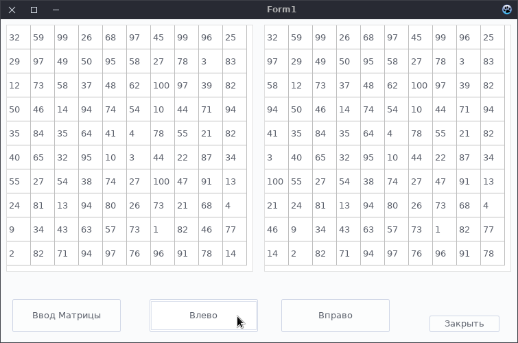

# Задача № 12
    Создать приложение, в рамках которого реализуется возможность перемещения элементов главной
    диагонали квадратной матрицы на первое место или последнее место соответствующих строк. Порядок
    следования остальных элментов не должен меняться. Процедуры ввода элементов матрицы,
    перемещения элементов должны располагаться в модуле пользователя, который подключается к проекту.
    Размерность матрицы вводится функцией InputBox.
    Интерфейс приложения включает в себя два компонента Memo(StringGrid) для отображения исходной и
    результирующей матрицы и 4 стандартные кнопки, позволяющие вводить матрицу, задавать направление
    перемещения и завершать приложение.

### В папке MemoEdition расположена реализация с Memo

### В папке StringGridEdition расположена реализация со StringGrid

