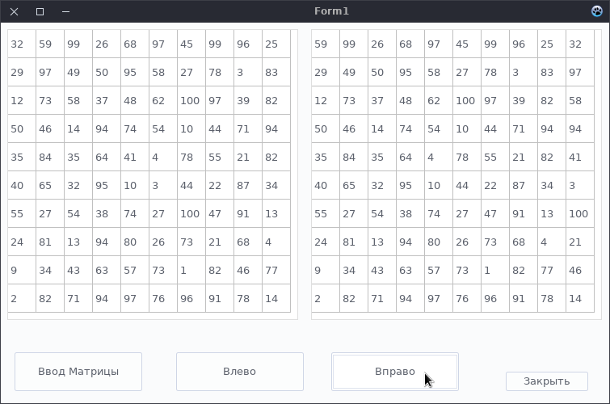
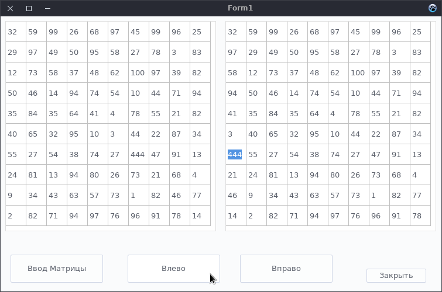

# Реализация с двумя StringGrid

## Примеры работы программы

#### Передвижение максимумов столбцов наверх

#### Передвижение максимумов столбцов вниз

### Возможна дополнительная задача
    Например, Когда пользователь сам изменяет таблицу(StringGrid) с исходной матрицей,
    то внесённые изменения должны отразиться на Результирущей матрице
    То есть мы должны считать данные из ЫекштпПкшв1 и потом обрабатывать матрицу

#### Сначала надо дать возможность пользователю изменять StringGrid1(Уже выставлено, но нужно знать как это делать)
    Для это выделяем на макете формы StringGrid1, дальше идём в 'Испектор Объектов' на вкладку 'Свойства',
    Потом ищем поле 'Options' и делаем два быстрых щелчка мышкой, чтобы открыть выпадающий список
    и напротив поля 'goEditing' ставим флажок.

##### Пример: Заменим рандомный елемент в левой матрице на 444 - теперь это самое большое число в 3-ем столбце

##### И нажмём на 'Максимумы ВНИЗ'
    Из скрина видно, что всё верно и число 444 переместилось вниз

